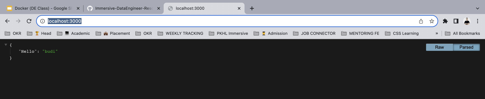

# 1. Build docker image

```bash
docker build -t my-application:latest .
```

# 2. Buat + jalankan docker container

```
-------------------------
| Host                  |
|                   |-- 3000
|   --------------- |   |
|   |             | |   |
|   |Container   8000   |
|   |             |     |
|   --------------      |
------------------------
```

```bash
docker run --name my-application-container -p 3000:8000 -e USER_NAME=budi -d my-application:latest
```

# 3. Stop container

```bash
docker stop my-application-container
```

# 4. Start container

```bash
docker start my-application-container
```

# 5. Hapus container

```bash
docker rm my-application-container
```

# 6. List image

```bash
docker images
```

# 7. List container

```bash
docker ps # list running container
docker ps -a # list all container
```

# 8. Remote container

```bash
docker exec -it <nama-container> bash
```

# 9. Munculin log

```bash
docker logs <nama-container>
```

# 10. Result


